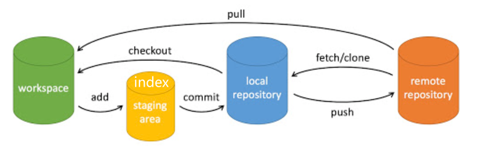

### 本地提交与修改
- `git add <file1 file2> ...` 将指定文件加入index，表明要跟踪他们
- `git status` 查看工作区状态，如果工作区index所指向的文件与仓库中的相比有变化，会给出具体提示。
- `git commit <file> [-a] [-m "xxx"]` 提交index中指定文件到本地仓库，-a表示提交index中所有文件，-m添加提交注释
- `git rm <file>` 将文件从工作区和index区删除
- `git reset` `git restore <file>` 回退版本并忽略修改。对某个文件修改后如果想要撤销，则应先reset，然后restore。
- `git mv` 等价于`mv`
- `git checkout -- <file>` 将file加入index后，如果想撤销修改，也可以使用此命令
### 日志

`git log` 查看提交日志
`git blae <file>` 按行查看指定文件的修改历史
### 分支管理
- `git branch` 列出所有分支
- `git branch <branchname>` 创建分支
- `git branch -d <branchname>` 删除分支
- `git switch -c <branchname> | git checkout [-b] <branchname>` 切换分支，-b, -c选项，如果分支不存在，则创建新分支并切换
- ``
### 远程管理
- `git push <remote> <branch>` 将当前分支推到远程仓库的指定分支
- `git pull <remote> <branch>` 将远程仓库的指定分支拉到本地
- `git fetch <remote>` 成功抓取后需要合并，才可以到工作区：`git merge [<remote>/]<branch>` 表示将\[远程仓库\<remote>的]\<branch>分支合并当本地当前分支
   - `--allow-unrelated-histories` 在合并阶段，加入这个选项和将无关历史合并到一起
- `git clone -b <branchname> <git address>` 通过选项-b可以指定远程仓库的指定分支
- `git remote show [origin]` 查看远程仓库列表或某个远程仓库的详细信息
### 仓库配置
- `git config -e [--global] [--system]` 打开配置文件并编辑，默认是当前仓库的配置文件，即`Dir/.git/config`，只影响当前仓库；`--global` 选项则打开用户级配置文件，即`username/.gitconfg`，影响当前用户的所有仓库；`--system`选项打开系统及配置文件，即`/etc/gitconfg`，影响当前系统上的所有git仓库
- `git config -l | --list` 列出当前仓库配置，从上到下依次列出系统级、用户级、仓库级的配置文件，其中，仓库级配置会覆盖用户级和系统及配置，用户级配置会覆盖系统及配置，总之，影响范围越小的配置优先级越高
### 加速访问GitHub
- 镜像代理
    - eg. “git clone [https://mirror.ghproxy.com/https://github.com/Fenlyin/MihoyoBBSTools.git”](https://mirror.ghproxy.com/https://github.com/Fenlyin/MihoyoBBSTools.git%E2%80%9D)
- 常用的镜像网站：
    1. [https://mirror.ghproxy.com/](https://mirror.ghproxy.com/)
    2. [https://gitclone.com/](https://gitclone.com/)
    3. [https://cnpmjs.org/](https://cnpmjs.org/)
    4. [https://shrill-pond-3e81.hunsh.workers.dev/](https://shrill-pond-3e81.hunsh.workers.dev/)
    5. [https://fastgit.org/](https://fastgit.org/)